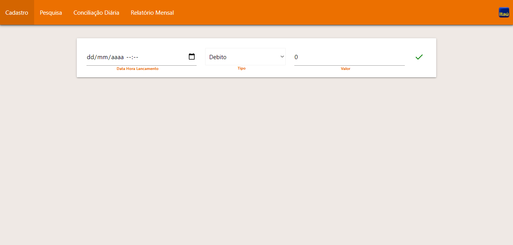

# Teste de Competência - Itaú
----
### Back-End
>Documentação automática da API (Swagger)

----
### Front-End
>Tela Inicial


>Tela de Cadastro de Lançamento Financeiro


>Tela de Pesquisa


>Tela de Pesquisa - Sem Lançamentos


>Tela de Pesquisa - Com Lançamentos


>Tela de Conciliação Diária


>Tela de Conciliação Diária - Sem Lançamentos/Sem Lançamentos Pendentes


>Tela de Conciliação Diária - Com Lançamentos Pendentes


>Tela de Relatório Mensal


>Tela de Relatório Mensal - Sem Lançamentos


>Tela de Relatório Mensal - Com Lançamentos


----
## Instalação
Para rodar esse teste após clonar, é necessário ter instalado o [Docker](https://hub.docker.com) e um terminal de comandos.

No terminal de comandos de sua preferência, navegue até a pasta raiz desse repositório e execute:
```bash
docker-compose up
```
O docker irá executar três containers:
+ mysql: contendo um banco de dados MySql com as configurações:
  + MYSQL_PORT: 3306
  + MYSQL_ROOT_PASSWORD: root
  + MYSQL_USER: teste_itau
  + MYSQL_PASSWORD: teste_itau
  + MYSQL_DATABASE: teste_itau
+ api: contendo a API Rest, que ficará disponível em
  + http://localhost:8081/ 
  + http://localhost:8081/swagger/index.html (Swagger) 
+ front: contendo o front-end da aplicação, que ficará disponível em
  + http://localhost:8082

----
----
## Utilização
Ao iniciar a API, alguns registros serão automaticamente inseridos no banco de dados para consultas e manipulações.
Os registros estão nas datas:
+ 01/03/2021
+ 02/03/2021
+ 03/03/2021
+ 04/04/2021

----
### Cadastro
Para cadastrar um novo lançamento, basta navegar até a aba "Cadastro", selecionar a data e hora do lançamento, selecionar o tipo de lançamento (Débito/Crédito) e inserir o valor, sendo que este não poderá ser menor ou igual à zero, e então pressionar o "tique" verde.

----
### Pesquisa, Edição e Exclusão
Para pesquisar os lançamentos de um determinado período, deve-se navegar até a aba "Pesquisa", informar o período desejado e pressionar "PESQUISAR", lembrando que a data inicial não pode ser posterior à data final.
Caso existam lançamentos no período solicitado, a listagem será exibida na tela.
Os lançamentos já conciliados serão exibidos com o status "Conciliado" e não poderão ser alterados ou excluídos.
Para editar um lançamento não conciliado basta alterar as informações e clicar no "lápis" verde.
É possível excluir um lançamento não conciliado clicando no "lixo" em vermelho.

----
### Conciliação Diária
Para pesquisar os lançamentos passíveis de conciliação de um determinado dia, deve-se navegar até a aba "Conciliação Diária", informar o dia desejado e pressionar "PESQUISAR".
Caso existam lançamentos não conciliados no dia solicitado, a listagem será exibida na tela.
Para efetivar a conciliação, é necessário que seja marcado "Conciliar" do lado direito de cada registro, para depois concluir pressionando o botão "Conciliar".
Uma vez conciliado, o lançamento não será exibido novamente nessa consulta.


----
### Relatório Mensal
Para consultar o relatório mensal, devemos navegar até a aba "Relatório Mensal", informar o mês e ano de referência e clicar em "Extrair".
Caso existam lançamentos no mês desejado, o relatório será exibido, contendo os lançametos agrupados por dia. Serão exibido os totais de débito, crédito e saldo de cada dia, e totais de débito, crédito e saldo do mês.

----
----
## Tecnologias
+ AspNetCore 5.0
+ Angular 12
+ MySql 5
+ Docker
+ Git
+ Git Flow


